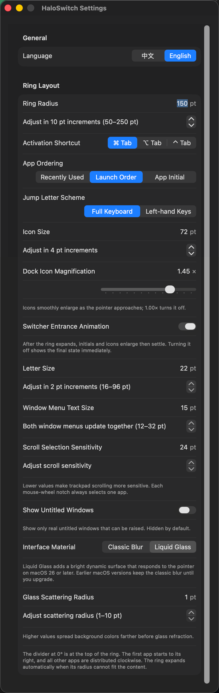
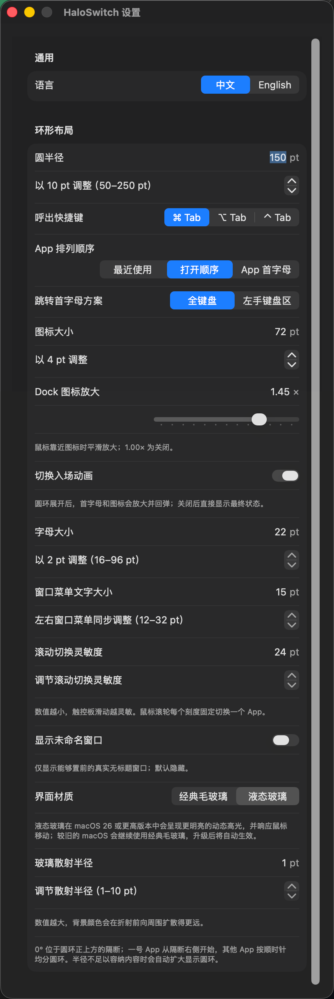

# HaloSwitch

> A fast, elegant radial app switcher built for macOS.

[English](#english) · [中文](#中文) · [Download the latest release](../../releases/latest)

## English

HaloSwitch replaces the traditional linear app switcher with a clean radial interface that appears around your pointer. Hold your preferred shortcut, then press an app's displayed letter, scroll, hover, click, or keep pressing `Tab` to reach exactly what you want.

### Bring back windows that Command-Tab leaves behind

> **Closed an app's last window while the app is still running? Native `Command + Tab` may activate the app without bringing a usable window back. HaloSwitch directly solves this everyday frustration.**

HaloSwitch can display the windows exposed by macOS Accessibility, restore hidden or minimized windows, and ask a still-running windowless app to reopen through the native macOS reopen mechanism. You can return to your work instead of switching to an app that appears active but shows nothing.

HaloSwitch does not launch apps that have fully quit. Its reopen feature applies when the app process is still running but has no visible window.

## Screenshots

> 📷 **Screenshot 1: Radial switcher**  

  

> 📷 **Screenshot 2: Liquid Glass**  

  

> 📷 **Screenshot 3: Sanded Glass** 

  

> 📷 **Screenshot 4: Settings**  

  

  

> 📷 **Screenshot 5: Window selection**  

  

## Highlights

### Jump to an app by letter

Every app receives a visible jump letter. While the ring is open, press that letter to select the app immediately. If several apps share the same letter, press it repeatedly to cycle through them.

HaloSwitch supports common Latin characters, compatibility mappings, and macOS system transliteration. Choose the full keyboard scheme or the left-hand keyboard zone for comfortable one-handed control.

### Keyboard, scroll wheel, trackpad, and pointer control

Use the familiar `Command + Tab`, or change the activation shortcut to `Option + Tab` or `Control + Tab`. Once the ring appears, you can:

- Press `Tab` to move forward or add `Shift` to move backward.
- Press a displayed letter to jump directly to an app.
- Scroll down to move clockwise or up to move counterclockwise.
- Hover over a sector and release the modifier to switch.
- Click a sector to activate its app immediately.

Trackpad movement is accumulated smoothly, and momentum events are ignored after you release your fingers to prevent accidental extra selections.

### Switch apps and individual windows

Selecting an app reveals the windows that it exposes through macOS Accessibility. Press the backtick key (`` ` ``) to cycle through those windows, or hover and click a window title directly.

HaloSwitch restores hidden and minimized windows when selected. A running app with no visible window receives the native reopen request, addressing a common limitation of the standard macOS switcher.

### Settings that adapt to you

Changes apply immediately, including while the switcher is visible:

- Ring radius, icon size, and jump-letter size
- Dock-style icon magnification
- `Command`, `Option`, or `Control` activation shortcut
- Recently used, launch order, or alphabetical app ordering
- Full-keyboard or left-hand keyboard jump-letter scheme
- Scroll-wheel and trackpad sensitivity
- Window-menu text size and untitled-window visibility
- Entrance animation
- Classic blur or Liquid Glass appearance
- Liquid Glass scattering radius
- Simplified Chinese and English interface languages

### Native, lightweight, and responsive

HaloSwitch is built with Apple's macOS technology stack, including Swift, SwiftUI, AppKit, Core Graphics, Accessibility, and NSWorkspace. It has no third-party runtime dependencies.

Global input events receive only lightweight, immediate processing. App metadata and icons are cached, and the overlay panels are reused to keep switching fast while avoiding unnecessary resource use.

HaloSwitch lives in the menu bar and stays out of the Dock. App and window information is processed locally and is never uploaded.

## Liquid Glass

On macOS 26 or later, HaloSwitch offers a native-style Liquid Glass ring with transparency, background scattering, edge refraction, and soft highlights.

Liquid Glass is not enabled automatically. Open HaloSwitch from the menu bar, choose **Settings**, and change **Interface Material** to **Liquid Glass**. You can also adjust the glass scattering radius from the same settings window.

On macOS 15–25, the Liquid Glass preference is preserved while HaloSwitch safely renders the classic blur appearance. The selected glass style becomes available after upgrading to macOS 26 or later.

## Installation

1. Download the latest `.dmg` from [Releases](../../releases/latest).
2. Open the DMG and drag **HaloSwitch** into **Applications**.
3. Launch HaloSwitch.
4. Open **System Settings → Privacy & Security → Accessibility** and allow HaloSwitch to control your Mac.
5. Return to the HaloSwitch menu-bar icon and choose **Recheck Accessibility Permission**. A restart is normally unnecessary.

If macOS says that it cannot verify the developer, try opening HaloSwitch once, then go to **System Settings → Privacy & Security** and choose **Open Anyway** for HaloSwitch.

## Controls

| Action | Result |
| --- | --- |
| `Command + Tab` | Open the ring and select the default app; configurable as `Option + Tab` or `Control + Tab` |
| Press `Tab` again | Select the next app |
| `Shift + shortcut + Tab` | Move backward through apps |
| Press a displayed letter | Jump to the matching app; repeat to cycle apps sharing that letter |
| Scroll down | Select clockwise |
| Scroll up | Select counterclockwise |
| Hover over a sector | Make that app the current selection |
| Click a sector | Activate that app immediately |
| Press `` ` `` | Cycle through windows belonging to the selected app |
| Hover or click a window title | Select or immediately open that window |
| Release the activation modifier | Confirm the current selection |
| `Escape` | Cancel switching |

## Requirements and notes

- macOS 15 or later
- macOS 26 or later for Liquid Glass
- Accessibility permission is required to intercept the configured global shortcut
- HaloSwitch shows running apps and does not launch apps that have fully quit
- Some third-party apps do not expose every window through Accessibility; app-level switching remains available
- Settings are stored locally and restored on the next launch

## Privacy

HaloSwitch requires no account, collects no usage data, and does not upload app, window, or keyboard information. Accessibility permission is used only to identify running apps, access switchable windows, and handle the global switcher shortcut.

## License

HaloSwitch is closed-source software. Copying, modification, reverse engineering, redistribution, or commercial use without permission is prohibited.

Copyright © 2026. All rights reserved.

---

## 中文

HaloSwitch 将传统的线性 App 切换方式变成简洁直观的环形轮盘。按住你设置的呼出快捷键，轮盘就会出现在鼠标附近；继续按 `Tab`、滚动鼠标滚轮、移动或点击鼠标，或者直接按下轮盘中显示的首字母，就能快速找到目标 App。

### 解决原生 Command-Tab 无法重新显示窗口的痛点

> **关闭了 App 的最后一个窗口，但 App 仍在后台运行？原生 `Command + Tab` 往往只能激活 App，却无法重新显示一个可用窗口。HaloSwitch 直击并解决了这个日常痛点。**

HaloSwitch 会显示 App 通过 macOS 辅助功能系统公开的窗口，恢复隐藏或最小化的窗口；当 App 仍在运行但已经没有可见窗口时，还会通过 macOS 原生机制向它发送重新打开请求。你不会再切换到一个看似已经激活、屏幕上却什么都没有的 App。

需要说明的是，HaloSwitch 不会启动已经彻底退出的 App。重新打开功能针对的是进程仍在运行、但最后一个窗口已经关闭的情况。

## 界面预览

> 📷 **Screenshot 1: Radial switcher**  

  

> 📷 **Screenshot 2: Liquid Glass**  

  

> 📷 **Screenshot 3: Sanded Glass** 

  

> 📷 **Screenshot 4: Settings**  

  

  

> 📷 **Screenshot 5: Window selection**  

  

## 主要特点

### 按首字母直达 App

每个 App 都会显示一个跳转字母。轮盘打开时，按下对应字母即可立即选中目标 App；多个 App 使用同一个字母时，重复按键可以在它们之间循环选择。

HaloSwitch 支持常见拉丁字母、兼容字符和 macOS 系统音译。你还可以选择“全键盘”或“左手键盘区”字母方案，让单手操作更加顺手。

### 键盘、滚轮、触控板和鼠标都能操作

你可以使用熟悉的 `Command + Tab`，也可以改用 `Option + Tab` 或 `Control + Tab`。轮盘出现后，可以通过以下任意方式选择：

- 按 `Tab` 顺序切换，配合 `Shift` 反向切换。
- 按轮盘中显示的首字母直达对应 App。
- 向下滚动鼠标滚轮或触控板，顺时针选择；向上滚动则逆时针选择。
- 将鼠标移到扇形区域后松开修饰键，切换到对应 App。
- 点击扇形，立即打开对应 App。

触控板位移会平滑累计，手指离开后的惯性事件不会继续旋转轮盘，减少误选。

### 在 App 和窗口之间自由切换

选中 App 后，HaloSwitch 会显示它通过 macOS 辅助功能系统公开的窗口。按反引号键（`` ` ``）可以在窗口之间切换，也可以使用鼠标悬停或点击窗口标题。

隐藏或最小化的窗口会在选择后自动恢复。仍在运行但没有可见窗口的 App 会收到系统原生的重新打开请求，解决原生切换器只激活 App、却没有窗口出现的问题。

### 丰富且即时生效的设置

HaloSwitch 提供完整的可视化设置界面，修改后立即生效，即使轮盘正在显示也不例外：

- 轮盘半径、App 图标大小和跳转字母大小
- Dock 风格的图标悬停放大倍率
- `Command`、`Option` 或 `Control` 呼出快捷键
- 最近使用、打开顺序或 App 首字母排列
- 全键盘或左手键盘区跳转字母方案
- 鼠标滚轮与触控板切换灵敏度
- 窗口菜单文字大小和未命名窗口显示选项
- 入场动画
- 经典毛玻璃或液态玻璃界面
- 液态玻璃散射半径
- 简体中文与 English 界面语言

### 原生、轻量、响应迅速

HaloSwitch 基于 Apple 的 macOS 原生技术栈构建，包括 Swift、SwiftUI、AppKit、Core Graphics、Accessibility 和 NSWorkspace，不依赖第三方运行库。

全局输入事件只进行轻量、即时的处理；App 信息和图标经过缓存，轮盘面板也会重复利用。这让日常切换保持快速流畅，同时减少不必要的资源消耗。

HaloSwitch 常驻菜单栏，不占用 Dock 空间。所有 App 和窗口信息均在本机处理，不会上传到网络。

## 液态玻璃

在 macOS 26 或更高版本中，HaloSwitch 支持原生风格的液态玻璃轮盘，包括透明背景、光线散射、边缘折射和柔和高光。

液态玻璃默认不会自动启用。请点击菜单栏中的 HaloSwitch 图标，打开 **设置**，在 **界面材质** 中选择 **液态玻璃**。你还可以在同一设置窗口中调整玻璃散射半径。

在 macOS 15–25 中选择液态玻璃时，HaloSwitch 会自动使用经典毛玻璃显示，并保留你的选择；升级到 macOS 26 或更高版本后即可显示液态玻璃。

## 安装方法

1. 在 [Releases](../../releases/latest) 下载最新的 `.dmg` 文件。
2. 打开 DMG，将 **HaloSwitch** 拖入 **Applications（应用程序）** 文件夹。
3. 启动 HaloSwitch。
4. 前往 **系统设置 → 隐私与安全性 → 辅助功能**，允许 HaloSwitch 控制电脑。
5. 返回菜单栏，点击 HaloSwitch 图标并选择 **重新检查辅助功能权限**。授权通常不需要重启 App。

如果 macOS 提示无法验证开发者，请先尝试打开 HaloSwitch 一次，然后前往 **系统设置 → 隐私与安全性**，找到 HaloSwitch 并选择 **仍要打开**。

## 操作指南

| 操作 | 效果 |
| --- | --- |
| `Command + Tab` | 呼出轮盘并选择默认 App；可改为 `Option + Tab` 或 `Control + Tab` |
| 继续按 `Tab` | 选择下一个 App |
| `Shift + 快捷键 + Tab` | 反向选择 App |
| 按显示的字母 | 直达对应 App；重复按相同字母可循环选择 |
| 滚轮或触控板向下 | 顺时针选择 App |
| 滚轮或触控板向上 | 逆时针选择 App |
| 鼠标悬停扇形 | 将对应 App 设为当前选择 |
| 点击扇形 | 立即切换到对应 App |
| 按反引号键 `` ` `` | 在当前 App 的窗口之间切换 |
| 悬停或点击窗口标题 | 选择或立即打开对应窗口 |
| 松开呼出快捷键的修饰键 | 确认当前选择并完成切换 |
| `Escape` | 取消本次切换 |

## 系统要求与使用说明

- macOS 15 或更高版本
- 液态玻璃需要 macOS 26 或更高版本
- 必须授予辅助功能权限，HaloSwitch 才能监听并替代全局切换快捷键
- HaloSwitch 只显示正在运行的 App，不会启动已经彻底退出的 App
- 某些第三方 App 不会通过辅助功能接口公开全部窗口，但仍可进行 App 级切换
- 所有设置均保存在本机，并会在下次启动时继续使用

## 隐私说明

HaloSwitch 不需要账号，不收集使用数据，也不会上传 App、窗口或按键内容。辅助功能权限仅用于识别正在运行的 App、读取可切换窗口以及处理全局切换快捷键。

## 支持 HaloSwitch

如果 HaloSwitch 对你有所帮助，并且你愿意支持它的后续开发，可以通过微信或支付宝请我喝杯咖啡 ☕️。

<table>
  <tr>
    <td align="center">
       
      <strong>微信支付</strong>
    </td>
    <td align="center">
       
      <strong>支付宝</strong>
    </td>
  </tr>
</table>

感谢你对 HaloSwitch 的支持 ❤️

## 软件许可

HaloSwitch 为闭源软件。未经许可，不得复制、修改、反编译、重新分发或用于商业用途。

Copyright © 2026. All rights reserved.
