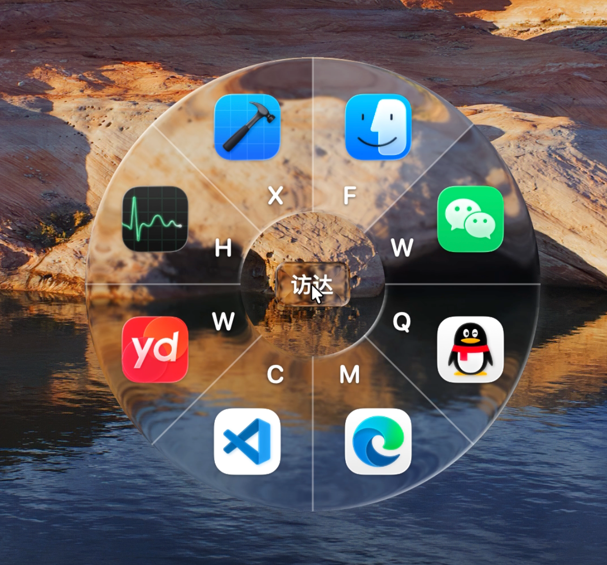
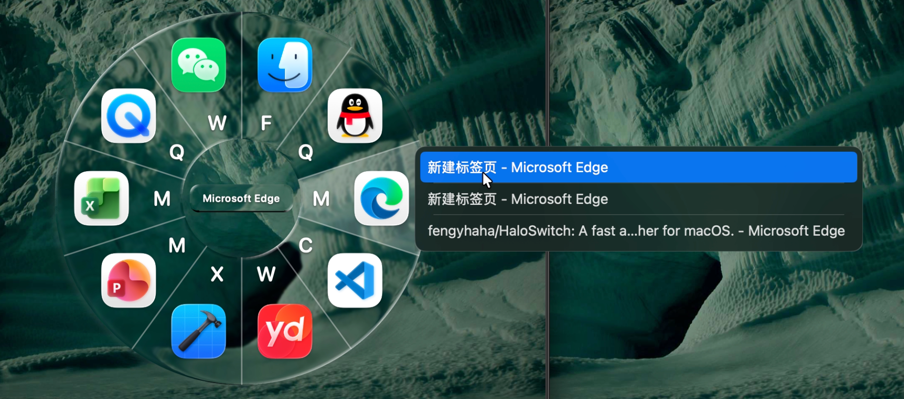
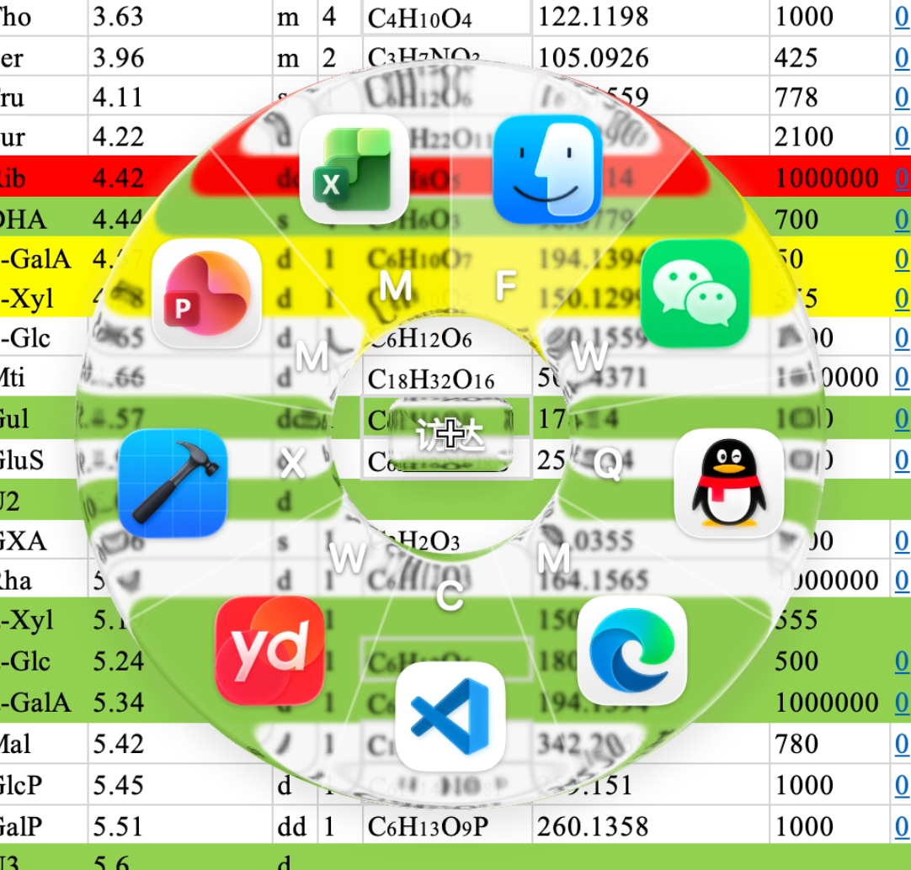
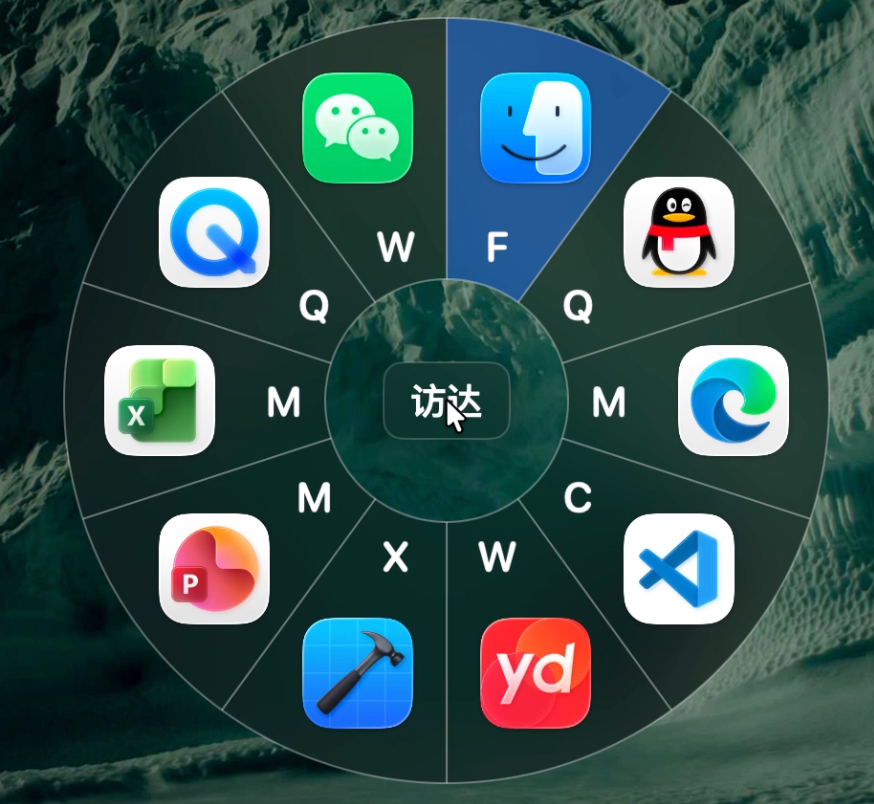
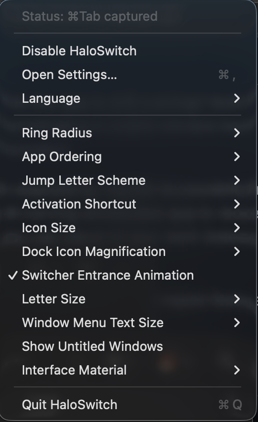
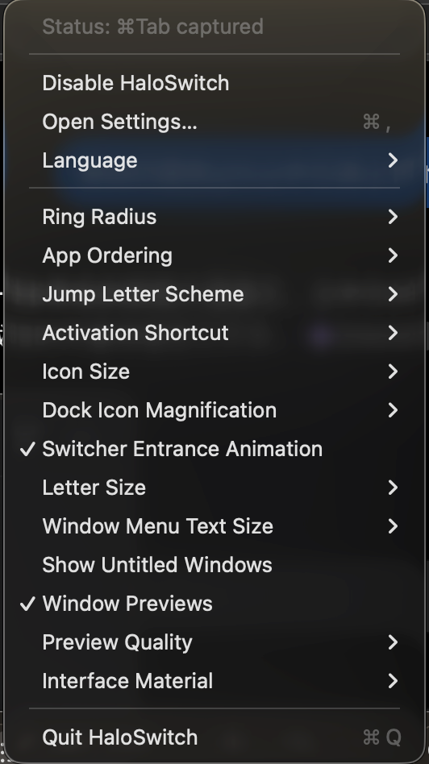
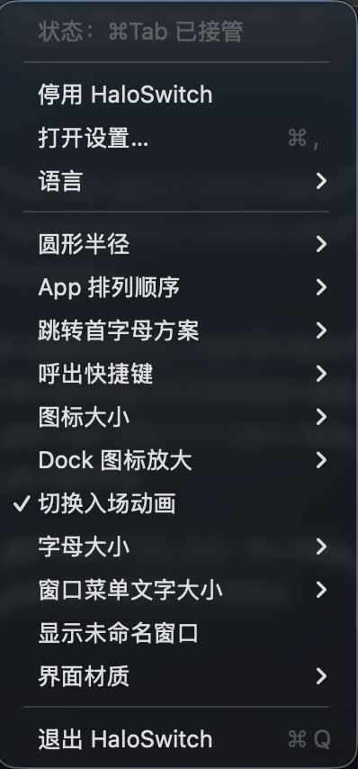
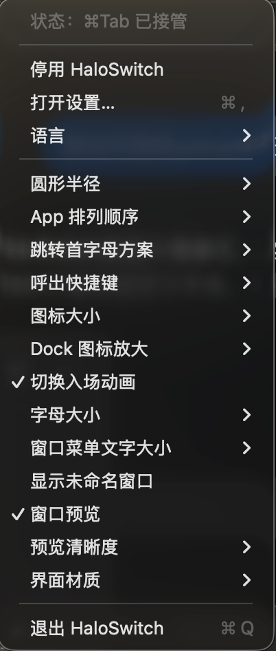

# HaloSwitch

> **A fast, visual, window-aware radial switcher for macOS.**
> Switch apps and individual windows with your keyboard, mouse, or trackpad — and preview a window before switching to it.

  <a href="../../releases/latest"><strong>Download the latest release</strong></a>
  ·
  <a href="#english">English</a>
  ·
  <a href="#中文">中文</a>

  
  
  

  

  

---

# English

## Why HaloSwitch?

The native macOS `Command + Tab` switcher works well for switching between apps, but it treats each app as a single item.

HaloSwitch adds **window-level switching** while keeping app switching fast and simple.

### Bring the window back — not just the app

If an app is still running but its window is minimized, hidden, or closed, native `Command + Tab` may activate the app without showing a usable window.

HaloSwitch can:

* restore minimized and hidden windows;
* return directly to a recently used window;
* skip closed or stale windows;
* ask a running app with no open window to reopen one.

### Preview before switching

Hover over a window title — or select it with the keyboard — to preview that window before switching.

  

Window previews are optional and can be configured for resolution, delay, and memory usage.

### App switching + window switching in one interface

The radial interface groups windows by app.

You can first select an app, then select the exact window you want — without turning the switcher into a long flat list of every open window.

---

## Highlights

### ⚡ Fast radial switching

HaloSwitch appears around the pointer so the distance to each app stays short and predictable.

Select apps using:

* `Tab` / `Shift + Tab`
* jump letters
* mouse movement
* scroll wheel
* trackpad
* direct clicking

### 🪟 Window-level switching

HaloSwitch keeps track of recent switchable windows instead of treating every app as one opaque item.

When possible, reopening the switcher returns to the previous valid, usable window.

### 👁 Live window previews

Enable **Window Previews** to inspect a window before opening it.

* Hover over a window title to preview it.
* Press `` ` `` to cycle through windows with the keyboard.
* Visible previews can refresh at up to approximately **15 FPS**.
* Preview resolution can be configured from **640 px to 2K (2560 px)**.
* Preview delay can be adjusted from immediate to **2 seconds**.
* Preview cache size can be configured from **32 MiB to 200 MiB**.
* Minimized windows can retain the most recent preview frame captured before minimization.

Preview availability depends on what macOS and the target application allow ScreenCaptureKit to capture. DRM video, protected content, secure system windows, or apps that reject capture may appear blank.

### 🔤 Multilingual jump letters

Each app receives a stable jump letter using macOS transliteration, Latin compatibility mappings, and fallback rules.

You can use:

* the full keyboard;
* a left-hand keyboard zone;
* hidden jump letters while keeping keyboard jumping enabled.

### 🎨 Native macOS appearance

Customize:

* ring radius;
* icon size;
* Dock-style magnification;
* menu typography;
* scroll sensitivity;
* opacity;
* blur;
* scattering radius;
* Liquid Glass / classic glass appearance.

Liquid Glass uses the native appearance on **macOS 26 or later**.

On macOS 15–25, HaloSwitch automatically falls back to the classic blur appearance.

  
  

---

## Controls

| Action                           | Result                                       |
| -------------------------------- | -------------------------------------------- |
| `Command + Tab`                  | Open HaloSwitch                              |
| `Option + Tab` / `Control + Tab` | Can be configured as the activation shortcut |
| Press `Tab` again                | Select the next app                          |
| `Shift + shortcut + Tab`         | Select the previous app                      |
| Press a jump letter              | Jump to the matching app                     |
| Scroll down / up                 | Select clockwise / counterclockwise          |
| Hover a ring sector              | Select that app                              |
| Click a ring sector              | Open that app immediately                    |
| Press `` ` ``                    | Cycle through windows of the selected app    |
| Hover a window title             | Select and preview that window               |
| Click a window title             | Open that window immediately                 |
| Release the activation modifier  | Confirm the current selection                |
| `Escape`                         | Cancel                                       |

---

## Settings

  
  

---

## Installation

1. Download the latest `.dmg` from **[Releases](../../releases/latest)**.
2. Open the DMG.
3. Drag **HaloSwitch** into the **Applications** folder.
4. Launch HaloSwitch.
5. Grant **Accessibility** permission when required.

### macOS security warning

HaloSwitch is currently **not notarized by Apple**.

When launching it for the first time, macOS may prevent it from opening because the developer cannot be verified.

If this happens:

1. Try to launch HaloSwitch once.
2. Open **System Settings → Privacy & Security**.
3. Scroll down to the HaloSwitch security message.
4. Click **Open Anyway**.
5. Confirm that you want to open HaloSwitch.

---

## Permissions

HaloSwitch uses two separate macOS permissions.

| Permission           | Required?    | Purpose                                                                        |
| -------------------- | ------------ | ------------------------------------------------------------------------------ |
| **Accessibility**    | **Required** | Global shortcut handling and reading, restoring, focusing, and raising windows |
| **Screen Recording** | Optional     | Window previews only                                                           |

### Accessibility

Open:

**System Settings → Privacy & Security → Accessibility**

and enable **HaloSwitch**.

If shortcut interception does not become active immediately, open the HaloSwitch menu-bar menu and choose:

**Recheck Accessibility Permission**

### Screen Recording

Screen Recording permission is required **only when Window Previews are enabled**.

Open:

**System Settings → Privacy & Security → Screen Recording**

and enable **HaloSwitch**.

Depending on your macOS version, the setting may be named **Screen & System Audio Recording**.

> HaloSwitch does not request Screen Recording permission until you explicitly enable Window Previews.

App and window switching continue to work normally if Screen Recording permission is denied.

---

## Privacy

HaloSwitch is designed to keep switching and preview data local.

* No account is required.
* No usage analytics are collected.
* App names are not uploaded.
* Window titles are not uploaded.
* Keyboard input is not uploaded.
* Window preview images are not uploaded.
* Preview frames remain only in a bounded in-memory cache.
* Preview frames are never written to disk.
* HaloSwitch does not record audio.

macOS may display its Screen Recording privacy indicator while window previews are being captured. This indicator is controlled by macOS.

---

## Requirements

* **macOS 15 or later**
* **macOS 26 or later** for native Liquid Glass
* Accessibility permission for switching
* Screen Recording permission only for optional window previews

Some third-party apps may not expose every window or may prevent their contents from being captured.

---

## Download

### **[Download the latest HaloSwitch release →](../../releases/latest)**

Open the DMG, drag HaloSwitch into Applications, grant Accessibility permission, and you're ready to switch.

---

## Feedback

Found a bug or have an idea for HaloSwitch?

Feel free to open an **Issue** on GitHub.

Feedback about:

* window compatibility;
* switching behavior;
* performance;
* window preview behavior;
* UI/UX;

is especially welcome.

---

## License

HaloSwitch is closed-source software.

Copying, modification, reverse engineering, redistribution, or commercial use without permission is prohibited.

Copyright © 2026. All rights reserved.

---

# 中文

> **快速、直观、以窗口为核心的 macOS 环形切换器。**
> 使用键盘、鼠标或触控板快速切换 App 和具体窗口，并可在切换前直接预览窗口内容。

  <a href="../../releases/latest"><strong>下载最新版本</strong></a>

## 为什么使用 HaloSwitch？

macOS 原生 `Command + Tab` 很适合在 App 之间切换，但它主要以 **App** 为单位，而不是以 **窗口** 为单位。

HaloSwitch 在保留快速 App 切换的同时，加入了更完整的**窗口级切换能力**。

### 不只是切换到 App，而是返回真正需要的窗口

当一个 App 仍在运行，但窗口已经被最小化、隐藏或关闭时，原生 `Command + Tab` 有时只会激活 App，却不会显示一个真正可用的窗口。

HaloSwitch 可以：

* 恢复最小化窗口；
* 恢复隐藏窗口；
* 返回最近使用的具体窗口；
* 自动跳过已经关闭或失效的窗口；
* 对仍在运行但已经没有窗口的 App 发送 macOS 原生重新打开请求。

### 切换之前先预览

将鼠标悬停在窗口标题上，或使用键盘选中窗口，就可以在真正切换之前查看窗口内容。

  

窗口预览完全可选，并且可以调整清晰度、延迟和内存占用。

### App 与窗口切换合二为一

HaloSwitch 的环形界面仍然按照 App 对窗口进行分组。

先快速选择 App，再精确选择其中的某一个窗口，不需要把所有打开的窗口全部塞进一个很长的列表。

---

## 主要特点

### ⚡ 快速环形切换

HaloSwitch 会围绕当前鼠标位置显示，因此每个 App 与指针之间的距离都比较短且稳定。

你可以使用：

* `Tab` / `Shift + Tab`
* 跳转字母
* 鼠标
* 滚轮
* 触控板
* 点击

完成选择。

### 🪟 窗口级切换

HaloSwitch 会记录最近使用的真实可切换窗口，而不是只把整个 App 当作一个切换单位。

再次呼出 HaloSwitch 时，会尽可能返回上一个仍然有效、可以正常置前的窗口。

### 👁 实时窗口预览

开启 **窗口预览** 后，可以在打开窗口之前确认其中的内容。

* 悬停窗口标题即可预览。
* 按反引号键 `` ` `` 可使用键盘循环选择窗口。
* 可见窗口最高约 **15 FPS** 刷新。
* 预览最长边可以从 **640 px 调整到 2K（2560 px）**。
* 预览延迟可以从立即显示调整到 **2 秒**。
* 内存缓存可以设置为 **32 MiB–200 MiB**。
* 窗口最小化后，可以继续显示最小化之前最后一次成功捕获的画面。

预览效果取决于 macOS 和目标 App 是否允许 ScreenCaptureKit 捕获窗口内容。

DRM 视频、受保护内容、安全系统窗口以及拒绝捕获的 App 可能无法正常显示预览。

### 🔤 多语言跳转字母

HaloSwitch 会使用 macOS 系统转写、拉丁兼容映射和稳定回退规则，为 App 分配跳转字母。

可以选择：

* 全键盘；
* 左手键盘区域；
* 隐藏显示字母但继续使用字母跳转。

### 🎨 原生 macOS 外观

可以调整：

* 轮盘半径；
* App 图标大小；
* Dock 风格放大倍率；
* 菜单文字；
* 滚动灵敏度；
* 不透明度；
* 模糊效果；
* 散射半径；
* 液态玻璃 / 经典毛玻璃效果。

macOS 26 或更高版本可使用系统原生 **Liquid Glass**。

macOS 15–25 会自动安全回退为经典毛玻璃效果。

  
  

---

## 操作指南

| 操作                               | 效果             |
| -------------------------------- | -------------- |
| `Command + Tab`                  | 呼出 HaloSwitch  |
| `Option + Tab` / `Control + Tab` | 可以设置为呼出快捷键     |
| 继续按 `Tab`                        | 选择下一个 App      |
| `Shift + 快捷键 + Tab`              | 选择上一个 App      |
| 按跳转字母                            | 快速跳转到对应 App    |
| 滚轮或触控板向下 / 向上                    | 顺时针 / 逆时针选择    |
| 悬停轮盘扇形                           | 选择对应 App       |
| 点击轮盘扇形                           | 立即打开对应 App     |
| 按反引号键 `` ` ``                    | 循环选择当前 App 的窗口 |
| 悬停窗口标题                           | 选择并预览窗口        |
| 点击窗口标题                           | 立即打开窗口         |
| 松开呼出快捷键的修饰键                      | 确认当前选择         |
| `Escape`                         | 取消切换           |

---

## 设置界面

  
  

---

## 安装

1. 前往 **[Releases](../../releases/latest)** 下载最新 `.dmg`。
2. 打开 DMG。
3. 将 **HaloSwitch** 拖入 **Applications（应用程序）**。
4. 启动 HaloSwitch。
5. 根据提示授予 **辅助功能权限**。

### macOS 安全提示

HaloSwitch 目前**尚未经过 Apple 公证（Notarization）**。

首次启动时，macOS 可能会提示无法验证开发者并阻止应用打开。

如果遇到这种情况：

1. 先尝试启动 HaloSwitch 一次。
2. 打开 **系统设置 → 隐私与安全性**。
3. 向下找到 HaloSwitch 对应的安全提示。
4. 点击 **仍要打开**。
5. 确认启动 HaloSwitch。

---

## 权限说明

HaloSwitch 使用两项相互独立的 macOS 权限。

| 权限       | 是否必须   | 用途                    |
| -------- | ------ | --------------------- |
| **辅助功能** | **必须** | 全局快捷键，以及读取、恢复、聚焦和置前窗口 |
| **屏幕录制** | 可选     | 仅用于窗口预览               |

### 辅助功能权限

打开：

**系统设置 → 隐私与安全性 → 辅助功能**

然后开启 **HaloSwitch**。

如果快捷键没有立即生效，可以打开 HaloSwitch 菜单栏菜单并点击：

**重新检查辅助功能权限**

### 屏幕录制权限

只有开启 **窗口预览** 后才需要屏幕录制权限。

打开：

**系统设置 → 隐私与安全性 → 屏幕录制**

并允许 **HaloSwitch**。

部分 macOS 版本中，该选项可能显示为：

**屏幕与系统音频录制**

> 在你主动开启窗口预览之前，HaloSwitch 不会申请屏幕录制权限。

即使拒绝屏幕录制权限，HaloSwitch 的 App 和窗口切换功能仍然可以正常使用。

---

## 隐私说明

HaloSwitch 的切换与窗口预览数据均保存在本地。

* 不需要注册账号；
* 不收集使用分析数据；
* 不上传 App 名称；
* 不上传窗口标题；
* 不上传键盘输入；
* 不上传窗口预览图片；
* 预览画面只存在于容量受限的内存缓存；
* 不会将预览图片写入磁盘；
* 不会录制音频。

在捕获窗口预览时，macOS 可能显示系统的屏幕录制隐私指示图标，该图标由 macOS 控制。

---

## 系统要求

* **macOS 15 或更高版本**
* 原生 Liquid Glass 需要 **macOS 26 或更高版本**
* 窗口切换需要辅助功能权限
* 只有可选的窗口预览功能需要屏幕录制权限

部分第三方 App 可能不会向 macOS 暴露所有窗口，或者可能禁止捕获窗口内容。

---

## 下载

### **[下载最新版本 HaloSwitch →](../../releases/latest)**

下载 DMG → 拖入应用程序 → 授予辅助功能权限，即可开始使用。

---

## 问题反馈

如果你发现 Bug，或者有新的功能建议，欢迎通过 GitHub **Issues** 反馈。

特别欢迎反馈：

* 特定 App 的窗口兼容性；
* 窗口切换逻辑；
* 性能问题；
* 窗口预览问题；
* UI / UX 建议。

---

## 支持 HaloSwitch

如果 HaloSwitch 对你有所帮助，并且你愿意支持后续开发，可以通过微信或支付宝请我喝杯咖啡 ☕️。

<table>
  <tr>
    <td align="center">
       
      <strong>微信支付</strong>
    </td>
    <td align="center">
       
      <strong>支付宝</strong>
    </td>
  </tr>
</table>

感谢你对 HaloSwitch 的支持 ❤️

---

## 软件许可

HaloSwitch 为闭源软件。

未经许可，不得复制、修改、反编译、重新分发或用于商业用途。

Copyright © 2026. All rights reserved.
